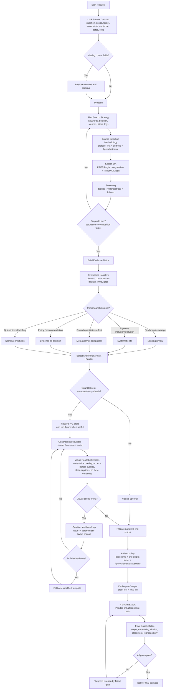

# Literature Research Synthesis Decision Flow

Use this map when you need an end-to-end view of how the skill decides:
- methodology,
- source strategy,
- output format,
- visual design,
- final quality gates.

## Decision Notes

1. Lock protocol before heavy retrieval to reduce post-hoc bias.
2. Stop by thematic saturation and composition quality, not citation count alone.
3. Decide methodology from intent first, then choose format and artifact bundle.
4. Treat visuals as evidence objects: reproducible, traceable, and layout-audited.
5. Convert user feedback into issue-indexed layout actions during figure iteration.
6. Freeze final figures with stable `*-final` names to avoid viewer cache confusion.
